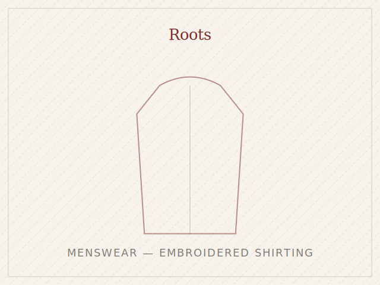

# Ayushi Kanojiya — Fashion Design Portfolio

A multi-page portfolio website. No build tools, no frameworks — just HTML, CSS
and a little JavaScript, so it's easy to host and easy to edit by hand.

---

## 1. What's in this folder

```
portfolio/
├── index.html              ← Home page (featured capstone banner + project grid)
├── about.html               ← About / bio / resume
├── work.html                 ← Full project index (featured capstone + all case studies)
├── project-capstone.html      ← Featured case study: Capstone — Prophetic's Halo
├── project-roots.html        ← Case study: Roots by Sujata Agrawal
├── project-pantaloons.html   ← Case study: Pantaloons Visual Merchandising
├── project-saree.html        ← Case study: Sustainable Saree Fashion
├── project-clo3d.html        ← Case study: CLO 3D — The Rathore Court
├── project-costume.html      ← Case study: Romeo & Juliet Costume Design
├── project-denim.html        ← Case study: Sustainable Denim Collection
├── contact.html               ← Contact page
├── vercel.json                ← Hosting configuration (see below)
├── assets/
│   ├── style.css              ← All design/layout styling (incl. slideshow &
│   │                             featured-banner components — see §5)
│   ├── main.js                 ← Navigation, animations, PDF viewer, slideshow logic
│   ├── portrait-placeholder.svg
│   ├── gen_covers.py           ← (optional) regenerates the SVG cover art
│   └── *-cover.svg             ← Editorial placeholder cover art per project
└── pdfs/
    ├── gen_placeholder_pdfs.py ← (optional) regenerates placeholder PDFs
    └── *.pdf                   ← Placeholder documents — replace these (see §3)
```

The capstone (Prophetic's Halo, the dragon-inspired avant-garde collection) is
treated as the flagship project — it gets a full-width banner above the
regular project grid on both the Home and Work pages, since it's the deepest
and most technically ambitious piece of work in the portfolio.

---

## 2. Hosting it on Vercel (step by step)

You don't need to know how to code for this part.

**Option A — Drag and drop (easiest)**
1. Go to [vercel.com](https://vercel.com) and sign up (free) with your email or GitHub.
2. Click **Add New → Project**.
3. Choose **"Deploy without Git"** / look for a drag-and-drop upload area.
4. Drag the whole `portfolio` folder in.
5. Click **Deploy**. Vercel gives you a live link like `ayushi-kanojiya.vercel.app` in under a minute.
6. You can later add a custom domain (e.g. `ayushikanojiya.com`) from the Vercel project's **Settings → Domains** tab.

**Option B — Via GitHub (better for future edits)**
1. Create a free [GitHub](https://github.com) account.
2. Create a new repository, e.g. `ayushi-portfolio`.
3. Upload all the files in this folder to that repository (GitHub's web interface has an "Add file → Upload files" button — no command line needed).
4. On Vercel, click **Add New → Project → Import Git Repository**, and select your repo.
5. Leave all settings as default (this is a static site, no build step needed) and click **Deploy**.
6. From now on, whenever you edit a file on GitHub and save, Vercel automatically re-publishes the live site within a minute.

The included `vercel.json` file tells Vercel how to serve the PDF documents correctly (viewable in-browser) — you don't need to touch it.

---

## 3. Replacing the placeholder content with your real files

Everything on the site currently uses **placeholder graphics** (editorial line-art
covers) and **placeholder PDFs** that say "replace me." This was necessary because
your original PDF files weren't available to build directly into the site — but
every filename is already wired up correctly, so replacing them is just a
drag-and-drop.

### A. Your real project PDFs

Open the `pdfs` folder and replace each placeholder with your real file,
**keeping the exact filename**:

| Replace this placeholder | With your file |
|---|---|
| `pdfs/Ayushi_Kanojiya_Resume.pdf` | `Resume__2_.pdf` |
| `pdfs/Internship_report_Roots.pdf` | `Internship_report_compressed.pdf` |
| `pdfs/Pantaloons_Visual_Merchandising.pdf` | `pantaloons_work_as_a_Visual_Merchandiser_compressed.pdf` |
| `pdfs/Sustainable_Saree_Fashion.pdf` | `sustainable_saree_compressed.pdf` |
| `pdfs/CLO3D_Rathore_Court.pdf` | `clo_3d_compressed.pdf` |
| `pdfs/Costume_Design_Romeo_Juliet.pdf` | `Costume_makeing_compressed.pdf` |
| `pdfs/Sustainable_Denim_Collection.pdf` | `DENIM_COLLECTION_compressed.pdf` |
| `pdfs/Capstone_Prophetics_Halo.pdf` | `capstone_project____________compressed.pdf` |

Just rename your file to match the name in the left column, and drop it into
`/pdfs`, replacing the old one. The **"View document"** buttons across the site
will then open your real PDF in the in-browser viewer automatically — nothing
else needs to change.

> **About the "view-only" PDF viewer:** the viewer hides the browser's built-in
> download button where supported and opens PDFs in an in-page overlay rather
> than a new download. This deters casual downloading, but no method (including
> paid tools) can make a PDF 100% impossible to save — a determined visitor can
> always screenshot it. Treat it as "download-discouraged," not encrypted.

### B. Your photos and screenshots

Every project page currently uses the same reusable placeholder graphic
(`assets/roots-cover.svg`, `assets/saree-cover.svg`, etc.) repeated for each
image on that page. To use your real photography instead:

1. Export/save the images you want from your PDFs (screenshot them, or export
   from the original design files) as `.jpg` or `.png`.
2. Upload them into the `assets` folder.
3. Open the relevant `project-*.html` file in any text editor (even Notepad
   or TextEdit works) and find lines like:
   ```html
   
   ```
   Change `assets/roots-cover.svg` to your new filename, e.g.
   `assets/roots-shirt-01.jpg`.
4. Save the file and re-upload/re-deploy.

Take your time with this — it's the single highest-impact upgrade you can make
to the site, since real garment photography will always outperform placeholder
line art.

### C. Your portrait image

You asked to keep your portrait **externally linked** rather than uploaded.
Two places reference it — `index.html` and `about.html` — both contain this line:

```html

```

Replace `https://your-image-host.example.com/ayushi-portrait.png` with the real
hosted URL of your image (for example, a link from Google Drive set to "anyone
with the link can view," Imgur, or any image host). Until you do this, the site
automatically falls back to a tasteful line-art placeholder frame, so nothing
ever looks broken in the meantime.

---

## 4. Adding a slideshow for extra images

Some projects have more images than fit comfortably in the standard side-by-side
layouts. `assets/style.css` and `assets/main.js` include a ready-to-use
slideshow/carousel component — it's already in use on the capstone project
page (the six "Look" illustrations) as a working example to copy from.

To add one to any page, paste this block wherever you want it and fill in
your own images and captions — add or remove `.slideshow-slide` blocks freely,
the arrows/dots/counter all adjust automatically to however many you include:

```html
<div class="slideshow" data-slideshow aria-label="Description of this set of images">
  <div class="slideshow-viewport">
    <div class="slideshow-track">
      <div class="slideshow-slide">
        
        <p class="slideshow-caption">Caption for this image.</p>
      </div>
      <div class="slideshow-slide">
        
        <p class="slideshow-caption">Caption for this image.</p>
      </div>
      <!-- add as many .slideshow-slide blocks as you need -->
    </div>
    <button class="slideshow-arrow prev" data-slide-prev aria-label="Previous image">←</button>
    <button class="slideshow-arrow next" data-slide-next aria-label="Next image">→</button>
    <div class="slideshow-counter" data-slide-counter></div>
  </div>
  <div class="slideshow-dots" data-slide-dots></div>
</div>
```

It supports click arrows, dot navigation, left/right arrow keys, and swipe on
touchscreens — no extra setup needed beyond pasting the block and filling in
images.

## 5. Editing text

All content is plain text inside the `.html` files — open any file in a text
editor, use **Find** (Ctrl/Cmd+F) to locate the sentence you want to change,
edit it, and save. No special software or coding knowledge is required for
text edits. Just be careful not to delete the `<` and `>` symbols around text,
as those are what make the page layout work.

---

## 6. What's already built in

- **Multi-page structure** — Home, About, Work index, 7 individual project
  case studies, and Contact, matching how a design agency site is structured.
- **Featured project banner** — the capstone project gets a full-width
  spotlight banner above the regular project grid on Home and Work, the way
  a design agency site would lead with its strongest, deepest piece of work.
- **Responsive design** — the layout adapts down to mobile phone width
  automatically (try resizing your browser window, or open the live link on
  your phone).
- **In-browser PDF viewer** — click "View document" anywhere and the PDF opens
  in an overlay on the page itself, rather than downloading.
- **Slideshow component** — for projects with more images than fit in a
  standard grid (see §4), with arrows, dots, keyboard and swipe support.
- **Contact form** — opens the visitor's email app pre-filled with their
  message; nothing is stored or sent through this site itself, so there's no
  backend to maintain.
- **Fast loading** — no page-builder frameworks, so it loads quickly even on
  slower connections.

---

## 7. If you want changes later

Everything is standard HTML/CSS, so any freelance web developer (or Claude,
in a future conversation) can pick this up instantly — just share this folder.
The design system (colours, fonts, spacing) all lives in one file,
`assets/style.css`, at the top under `:root { ... }`, so consistent
sitewide changes (like adjusting the maroon accent colour) only need to be
made in one place.
